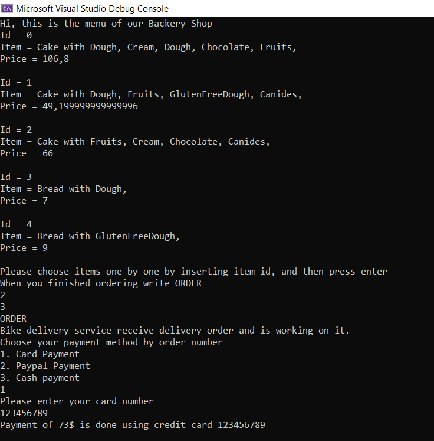
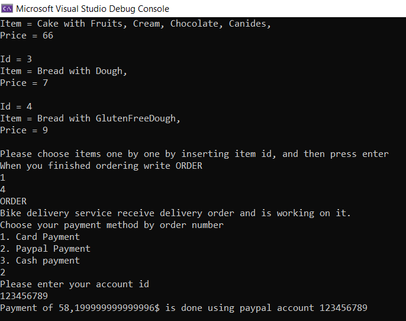
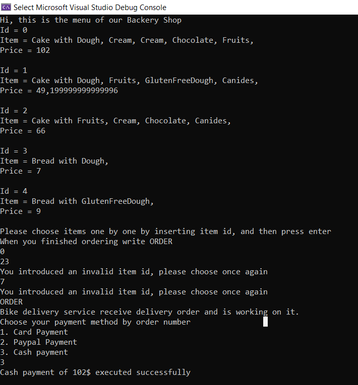

# Topic: _Behavioral Design Patterns_

### Author: _Mazur Daniela_

---

## Objectives :

**1. Study and understand the Behavioral Design Patterns.**

**2. As a continuation of the previous laboratory work, think about what communication between software entities might be involed in your system.**

**3. Implement some additional functionalities using behavioral design patterns.**

## Theory :

Behavioral design patterns are concerned with the interaction and responsibility of objects.

In these design patterns, the interaction between the objects should be in such a way that they can easily talk to each other and still should be loosely coupled.

That means the implementation and the client should be loosely coupled in order to avoid hard coding and dependencies.

Some examples from this category of design patterns are :

- Chain of Responsibility
- Visitor
- Command
- Interpreter
- Iterator
- Mediator
- Observer
- Strategy

## Implementation :

In this project I've used Strategy behavioral design pattern to implement payment in different modes: [Card](../BakeryShop/Domain/PaymentStrategies/CardPaymentStrategy.cs), [Cash](../BakeryShop/Domain/PaymentStrategies/CashPaymentStrategy.cs), [Paypal](../BakeryShop/Domain/PaymentStrategies/PayPalPaymentStrategy.cs)<br />
The Strategy pattern suggests that you take a class that does something specific in a lot of different ways and extract all of these algorithms into separate classes called strategies.

The original class, called context, must have a field for storing a reference to one of the strategies. The context delegates the work to a linked strategy object instead of executing it on its own.

The bellow snippet can be found [here](../BakeryShop/Domain/PaymentStrategies/PaymentContext.cs)

```
     class PaymentContext
     {
          private IPaymentStrategy _paymentStrategy;


          public void SetStrategy(IPaymentStrategy strategy)
          {
               _paymentStrategy = strategy;
          }

          public void ExecuteStrategy(double amount)
          {
               _paymentStrategy.Pay(amount);
          }
     }
```

The PaymentContext isn’t responsible for selecting an appropriate way of payment. Instead, the client passes the desired payment strategy to the context. In fact, the context doesn’t know much about strategies. It works with all strategies through the same generic interface IPaymentStrategy, which only exposes a single method (Pay) for triggering the algorithm encapsulated within the selected strategy.

References => https://refactoring.guru/design-patterns/strategy

## Example :

Card Payment


<br/>Paypal payment


<br/>Cash payment


